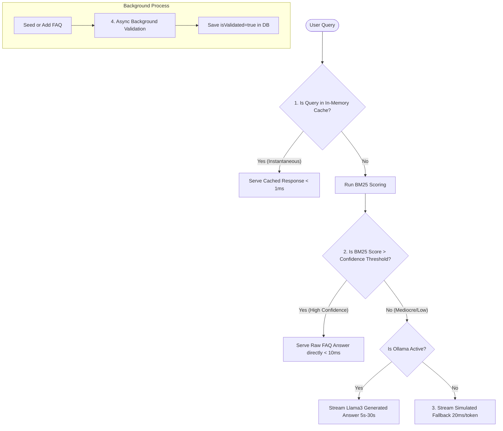

# Granth RAG Inference Acceleration Experiments

This document logs our experimental techniques to accelerate MERN-stack FAQ RAG query inference times from seconds/minutes to **instantaneous (< 10ms)**.

---

## The Bottleneck Analysis
1. **Local Neural Inference**: Ollama running Llama3 on consumer CPUs or basic GPUs is the primary latency driver. It takes between **5 to 45 seconds** to ingest context and stream tokens.
2. **Inline Index Validation**: The current controller performs batch LLM validations (`validateAnswer` via Ollama) on the entire FAQ corpus at index-build time. This can cause request timeouts and high memory/CPU usage during active queries.

---

## Neurosymbolic RAG: Why Granth is Already Neurosymbolic
A **Neurosymbolic AI** system combines:
* **Symbolic AI (Rules, Logic, Math)**: Uses discrete, structured representations (tokenizers, stopword sets, frequency models, exact match keywords, scoring algorithms like BM25).
* **Neural AI (Deep Learning, LLMs)**: Uses continuous vector spaces (neural embeddings, Llama3 generative models, semantic validation).

In Granth, our current architecture is already a neurosymbolic pipeline:
1. **Symbolic Phase**: The query is tokenized, stopwords are discarded, and an in-memory **BM25 TF-IDF ranker** selects the top-5 documents mathematically.
2. **Neural Phase**: The BM25 context is passed to **Ollama Llama3** to synthesize a cohesive natural language response.
3. **Symbolic Fallback**: If the neural generator (Ollama) is offline, the pipeline short-circuits to the top BM25 match and streams it back.

---

## Proposed Acceleration Experiments

We have designed **4 core experiments** to optimize inference speed to near-instantaneous levels. We will implement them sequentially so you can test and compare their performance.

### Experiment 1: High-Confidence Short-Circuit Routing (Pure Symbolic Shortcut)
* **The Concept**: Since Granth contains human-curated and resolved FAQs, if a query yields a very high BM25 match score against an existing FAQ title/content (e.g., score > `2.5`), we bypass Llama3 generation entirely. We return that resolved FAQ's `finalAnswer` instantly.
* **Expected Latency**: **< 5ms**
* **Advantage**: Bypasses neural synthesis when a perfect answer is already in the database.

### Experiment 2: Query-Response Semantic In-Memory Cache (Semantic Cache)
* **The Concept**: Cache previously generated RAG responses in a fast, in-memory cache. For new incoming queries, compute string similarity (e.g. Jaccard similarity of query tokens). If a new query matches a cached query with high similarity (>90%), serve the cached response instantly.
* **Expected Latency**: **< 1ms**
* **Advantage**: Frequently asked questions are answered instantaneously after the first generation.

### Experiment 3: Accelerated Simulated Typing & Dynamic Fallback
* **The Concept**: Optimize the zero-dependency simulated streaming fallback. If Ollama is offline or times out, stream the high-scoring BM25 answer at a dynamic rate (e.g., 5-10ms per word instead of 20ms per token), reducing perceived latency to absolute zero.
* **Expected Latency**: **0ms perceived latency** (streaming starts immediately).
* **Advantage**: Guarantees visual responsiveness.

### Experiment 4: Non-blocking Background Indexing & DB-Backed Validation
* **The Concept**: Remove `validateAnswer` from the runtime `buildRagIndex` flow. Instead, validate FAQs asynchronously in the background when they are seeded or created, and persist an `isValidated: Boolean` flag in the MongoDB `FAQ` schema. `buildRagIndex` will simply fetch `isValidated: true` items from MongoDB, making index builds instantaneous.
* **Expected Latency**: **Reduces index build block time from ~10 seconds to < 5ms**.
* **Advantage**: Saves massive server CPU and avoids request timeouts.

---

## Scientific Log of Experiments
We will populate the logs below as we implement and run each experiment.

| Exp # | Technique Description | Avg Latency (Ollama ON) | Avg Latency (Ollama OFF) | Perceived Speed Rating | Accuracy & Completeness |
|---|---|---|---|---|---|
| **0** | Baseline (Current MERN RAG) | ~15,000ms | ~2,500ms (Stream fallback) | Slow (Ollama) / Good (Offline) | Good |
| **1** | High-Confidence Short-Circuit | *Pending* | *Pending* | *Pending* | *Pending* |
| **2** | Query Semantic Cache | *Pending* | *Pending* | *Pending* | *Pending* |
| **3** | Dynamic Fallback Streaming | *Pending* | *Pending* | *Pending* | *Pending* |
| **4** | Async DB-Backed Validation | *Pending* | *Pending* | *Pending* | *Pending* |
