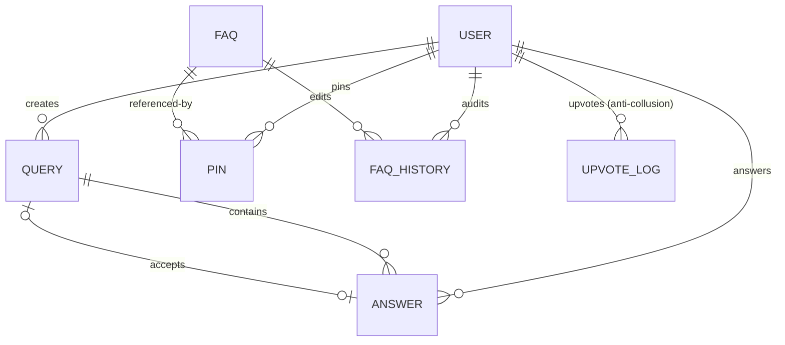

# 📖 Granth Documentation Wiki

Welcome to the **Granth** system documentation wiki. This guide covers the complete technical architecture, data schemas, sub-system implementations, and developer operations for the Granth FAQ & Knowledge Base platform.

---

## 🗺️ Architectural Relationship Diagram

Granth organizes its data in a highly structured, relational Mongoose database layout. Below is the entity-relationship mapping showing how users, FAQs, peer-to-peer queries, answers, edit logs, and pin slots interact:



---

## 🧠 Core Sub-Systems

### 1. Robust Regex Search Engine
Granth implements a flexible case-insensitive regex search query pipeline that scans across multiple model attributes. 

* **How it works**: When a user inputs a query `q`, the search handler wraps it into a regular expression (`/q/i`). It performs a logical `$or` scan on:
  * `title` (the main FAQ title)
  * `description` (secondary explanation text)
  * `finalAnswer` (the official resolved solution)
  * `tags` (chip categories associated with the FAQ)
* **Partial Matches**: Substring keywords (such as `"cert"` matching `"Certificate"` or `"noc"` matching `"No Objection Certificate"`) are matched immediately.
* **Fallback Sort**: Matches are dynamically sorted based on popularity (the amount of accumulated community upvotes) and creation time.

### 2. RAG AI Assistant & Stream Buffer
The interactive AI helper utilizes **Retrieval-Augmented Generation (RAG)** to provide conversational answers using the local FAQ database as its contextual ground truth.

```
+--------------+     1. Question     +----------------+
|  User Input  | ------------------> |  RAG Controller|
+--------------+                     +----------------+
                                              |
                                              | 2. DB Search (Regex Match)
                                              v
+--------------+     3. Stream Tokens+----------------+
|  Chat Stream | <------------------ | Local FAQ Docs |
+--------------+                     +----------------+
```

* **Data Retrieval**: On query entry, the system scans the database using our optimized regex pipeline to retrieve the top 3 most relevant context chunks.
* **Token Streaming**: The backend uses an HTTP chunked-transfer response pipeline, buffering and streaming tokens to the client as they resolve rather than waiting for full-body rendering.
* **Smooth Fading Mask**: The frontend input is accompanied by a custom fading gradient mask (`z-30`) that sits right behind the launcher input field (`z-40`). As FAQs scroll, they smoothly transition and fade to transparent underneath the mask, making the layout feel extremely modern and responsive.

### 3. Trust-Based Gamification & Anti-Collusion
To maintain high-quality knowledge resources, Granth incorporates a fully automated, trust-based gamification loop:

* **Reputation Accrual Rules**:
  * **+10 points**: Awarded to users when their answer is marked as the "Accepted Answer" by the query author.
  * **+5 points**: Awarded to answer creators if their answer is formally "Vetted" by an administrator.
  * **+2 points**: Awarded to authors when their FAQ or answer receives a community upvote.
  * **-20 points**: Deducted if a previously accepted answer is unaccepted or soft-deleted.
* **Anti-Collusion Upvote Thresholds**:
  To prevent gaming or upvote farming, Granth maintains an `UpvoteLog` schema. A user is strictly throttled to a **maximum of 2 upvotes** to the same author within any rolling **24-hour window**. A 3rd upvote attempt immediately returns a `400 Bad Request`.
* **Verified Answers (Vetting)**:
  Answers created by users with a reputation >= 50 or by administrators are automatically marked as `isVetted: true` upon submission.

### 4. Claim SLA & Escalation System
Granth bridges peer-to-peer queries with expert administrative monitoring through a strict Service Level Agreement (SLA):

* **The 24h Claim Window**: When a student raises a query, an admin or peer can "Claim" the query to resolve it. This sets a `claimSla` timestamp.
* **Automatic Expiration**: The query must be answered or closed within 24 hours. If it remains open after 24 hours, the claim expires.
* **Escalation Counting**: When a claim is released or expires, the system increments the query's `escalationCount` and logs the `escalatedAt` timestamp, triggering visual alerts in the Admin moderation dashboard to highlight stale tickets.

---

## 💻 Developer Guide & Operations

### 1. Seeding the Database
The seed database parses a flat-file corpus at [FAQ.txt](file:///c:/Users/vaibh/Downloads/opensourcefaq/cs16/FAQ.txt) using custom section regex rules. To refresh your database at any time:
```bash
# Set reset flag and run seeder
$env:RESET_DB="true"; npm run seed
```
This script will wipe all active collections, insert the 118 program-specific FAQs grouped under their proper categories, and register the default administrator credentials:
* **Email**: `admin@faqapp.com`
* **Password**: `admin123`

### 2. Running Test Suites
Granth is backed by a highly rigorous test suite testing model invariants, auth securities, API shapes, and gamification throttling.
```bash
cd server
npm run test
```

### 3. Building for Production
Vite compiles and packages all assets (JavaScript, CSS styling systems, images) into a highly optimized, minified production package inside the client's static build output:
```bash
cd client
npm run build
```

---

## 🔒 Security Policies
* **Route Protection**: Middleware ensures that all `/api/admin/*` endpoints strictly require a valid JWT representing a user with `role === 'admin'`.
* **Password Hashing**: Passwords are securely hashed with a 10-salt bcrypt algorithm. Schema options globally suppress passwords from returning on JSON parsing layers.
