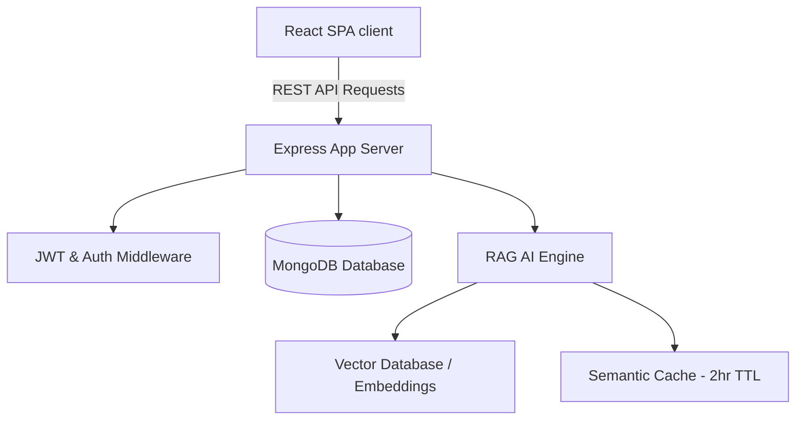

# Grantha Platform: Technical Overview & Demo Script

Welcome to the presentation guide for **Grantha**, a premium, gamified open-source Q&A and FAQ platform featuring semantic AI assistance and advanced administrative moderation.

This document serves as both a **technical reference (the WHY & HOW)** and a **slide-by-slide presentation script** to help guide you through a flawless demo.

---

## Part 1: Platform Capabilities & Architecture

Grantha is structured around a decoupled MERN stack (MongoDB, Express, React, Node.js) optimized for community knowledge-sharing.

### Core Architecture Highlights
1. **Trust-Based Gamification**: Reputation-driven capabilities (answering, vetting) designed with anti-collusion limits (throttled upvoting, self-upvote prevention).
2. **Response-Driven Query Management**: Open questions have response windows. Volunteers claim queries, and a background claims scheduler automatically releases abandoned claims after 48 hours to keep questions active.
3. **AI RAG Assistant**: Vector-search-driven semantic chat widget featuring an optimized semantic cache layer. Hits are resolved semantically, evicting stale records automatically.
4. **Moderation Control Station**: Dynamic light/dark theme dashboard with analytics, bulk actions (ban/unban/promote), announcement pins, and an audit trail system.

---

## Part 2: Feature Deep-Dive (The WHY & The HOW)

Here is a breakdown of the critical features built and optimized during this phase, explaining the business rationale (**WHY**) and technical execution (**HOW**).

| Feature | The WHY (Business Value) | The HOW (Implementation Details) |
| :--- | :--- | :--- |
| **Admin Dashboard Right-Sidebar Nav** | Clean separation of control panel commands. Maximizes content width for grids/charts on desktop. | Restructured the grid layout in [AdminDashboard.jsx](file:///client/src/pages/AdminDashboard.jsx). Sticky sidebar on desktop collapses gracefully to a horizontal tab row on mobile. |
| **Markdown RAG Chat Assistant** | Code snippets, lists, and links are unreadable as raw strings. Beautiful parsing creates a premium chat assistant experience. | Integrated the `marked` library in [RAGChatWidget.jsx](file:///client/src/components/RAGChatWidget.jsx). Rendered content inside an HTML `.prose` container with streaming cursor indicators (`▌`). |
| **FAQ Sorting by Upvotes** | As the FAQ database grows, users need quick access to the most valuable, upvoted community knowledge. | Added `sort` query parameter in [api.js](file:///client/src/services/api.js). Updated Mongoose queries in [categoryController.js](file:///server/controllers/categoryController.js) to dynamically sort by upvotes or pins. |
| **Leaderboard Integrity** | Answering bots (RAG Bot) with simulated rep should not clutter the human weekly/all-time leaderboards. | Filtered out `ragbot@faqapp.local` in [userController.js](file:///server/controllers/userController.js) and category contributors. Blocked the AI widget on the `/leaderboard` route. |
| **FAQ Merging & Deduping** | Volunteers often write duplicate answers. Admins must be able to merge duplicate threads without losing tag lists or related connections. | Created a `POST /api/admin/faqs/merge` endpoint. Built a debounced modal in the client allowing admins to search target FAQs or input ObjectIds directly. |
| **Moderation & Audit Station** | Admins need a single pane of glass to handle approvals, track query breaches, and review histories. | Replaced the simple FAQ Requests tab with a split-grid container displaying pending requests, response-breached queries, and a Mongoose-populated edit-history audit log. |
| **Dynamic Light/Dark Themes** | Platform admins work long hours in various environments. Theme sync prevents eye strain and builds a premium UI feel. | Bound dashboard colors to variables mapping back to the global [ThemeContext.jsx](file:///client/src/context/ThemeContext.jsx), respecting light paper or dark obsidian styling. |

---

## Part 3: Presentation Script

### Slide 1: Welcome & Vision
* **Presenter Action:** Display the home page of the application (Light Theme).
* **Speaker Script:**
  > "Hello everyone, and welcome to the demo of Grantha, a premium open-source knowledge engine designed for modern developers and active communities.
  >
  > Most FAQ portals are static, stale, and siloed. Grantha changes this by introducing three core pillars: dynamic, response-driven query tracking; trust-based volunteer gamification; and a state-of-the-art semantic AI RAG assistant. Let's start by walking through the portal as a user."

---

### Slide 2: User Q&A, Response Windows, and Upvote Sorting
* **Presenter Action:** Click on the FAQs tab, type in a search query, select the "Sort By: Upvotes" option, and toggle between categories.
* **Speaker Script:**
  > "For users, finding answers should be immediate. Grantha indexes resolved knowledge inside category tags. As our repository grows, users can dynamically sort FAQs by upvotes or pin rankings. This ensures the most authoritative, community-vetted information is always presented first.
  >
  > Under the hood, this queries our backend with dynamic Mongoose sorting schemas, updating the UI reactively without page reloads."

---

### Slide 3: AI Chat Assistant with Streaming & Markdown
* **Presenter Action:** Click the floating RAG chat widget in the lower right. Type: `"How do I apply for a scholarship?"` and watch it stream.
* **Speaker Script:**
  > "When static search isn't enough, our RAG AI Assistant provides instant, interactive resolutions. As you see, the response streams back in real-time, accompanied by a dynamic cursor block that provides immediate feedback.
  >
  > Instead of unformatted plaintext, responses are beautifully parsed into clean, readable markdown layout syntax—complete with formatted headers, bullets, bold text, and code blocks.
  >
  > Physically, this uses an integrated markdown parser wrapping the streaming response stream. Behind the scenes, we've implemented a semantic cache. If another user asks a similar question, the cache returns a hit instantly, saving server resources and evicting itself automatically after 2 hours."

---

### Slide 4: Trust-Based Gamification & Vetting
* **Presenter Action:** Go to the Community Board and highlight an answer card with a "Vetted" badge, then point out the user's reputation count.
* **Speaker Script:**
  > "Quality control is crowdsourced through our Trust-Based Gamification system. Users earn reputation points for their contributions.
  >
  > An answer created by an admin or a user with a reputation of 50+ is auto-vetted. For others, it goes through peer review. Peers with 100+ reputation can verify answers. To prevent collusion, users cannot self-upvote, and upvoting frequency between identical peers is throttled at the database level."

---

### Slide 5: The Leaderboard and Bot Exclusions
* **Presenter Action:** Navigate to the Leaderboard. Point out the absence of the AI assistant widget on this page.
* **Speaker Script:**
  > "Here is our Leaderboard page, tracking weekly and lifetime contributions. You'll notice two key enhancements here:
  >
  > First, the floating RAG chat widget is automatically hidden on this screen to ensure distraction-free browsing of community standings.
  >
  > Second, we enforce leaderboard integrity. The AI assistant bot, which naturally possesses a high system reputation, is programmatically excluded from weekly, lifetime, and category lists. The leaderboard remains a space reserved strictly for human contributors."

---

### Slide 6: Admin Dashboard Sidebar & Dynamic Theme
* **Presenter Action:** Log in as an admin. The dashboard opens immediately. Toggle the global light/dark theme switch.
* **Speaker Script:**
  > "When an administrator logs in, Grantha automatically detects their role and redirects them straight to the Control Station.
  >
  > Notice the design system: the admin dashboard features a vertical right-sidebar navigation panel on desktop to optimize horizontal real estate for tables and data logs.
  >
  > The entire dashboard supports our light and dark theme context. Toggling the theme transforms the dashboard from a clean, warm paper theme into a sleek, obsidian dark environment, preventing screen glare during nighttime operations."

---

### Slide 7: FAQ Merging & De-duplication
* **Presenter Action:** Navigate to the 'Manage FAQs' tab. Click 'Merge' on a duplicate FAQ. Type a keyword in the debounced search box, select the target FAQ from the results, and click 'Confirm Merge'.
* **Speaker Script:**
  > "A common pain point for community admins is de-duplication. Under 'Manage FAQs', we have introduced a powerful merging interface.
  >
  > Clicking 'Merge' opens our dedicated Modal. Admins can type to search active target FAQs—powered by a debounced query function that spares server bandwidth—or manually enter the 24-character target ObjectId.
  >
  > Confirming the merge instructs the backend to group both entries: it concatenates titles and descriptions, merges and deduplicates tag lists, re-routes related questions, and soft-deletes the duplicate source. No knowledge is lost, and the FAQ index stays clean."

---

### Slide 8: Moderation Control & Revision Audits
* **Presenter Action:** Switch to the 'Moderation & Audit' tab. Scroll through the columns: FAQ Requests, Response Breaches, and FAQ Revision History.
* **Speaker Script:**
  > "Finally, let's look at the heart of our operations: the 'Moderation & Audit' panel.
  >
  > This panel brings everything into a single, cohesive dashboard:
  > - **Pending FAQ Requests**: Moderation cards submitted by volunteers that admins can approve or reject in one click.
  > - **Response-Breached Queries**: Live alerts for questions that have expired without answers, letting admins claim or close them instantly.
  > - **FAQ Revision History**: An immutable audit trail showing exact field-level changes (Title, Description, Answer, Tags), who performed the edit, the reason for the change, and the timestamp.
  >
  > This guarantees total operational clarity and compliance across the platform."

---

### Slide 9: Q&A / Wrap Up
* **Presenter Action:** Return to the dashboard main panel.
* **Speaker Script:**
  > "In summary, Grantha combines AI semantic search, trust-based gamification, and robust administrative tools to make community support faster, cleaner, and self-sustaining.
  >
  > Thank you for your time. I would love to open the floor to any questions!"
