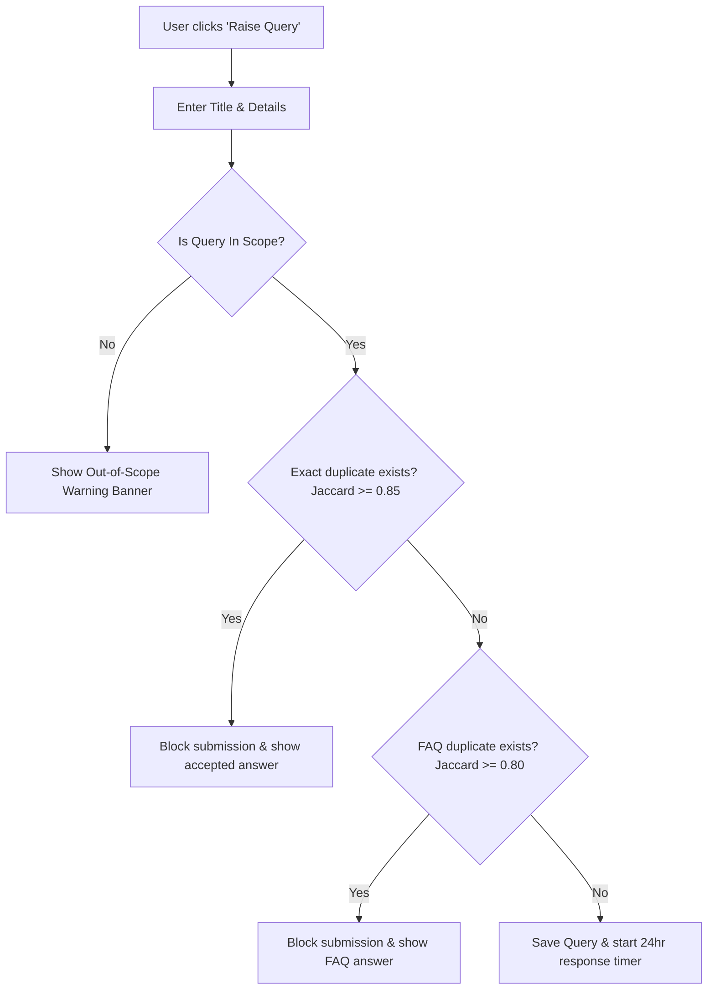
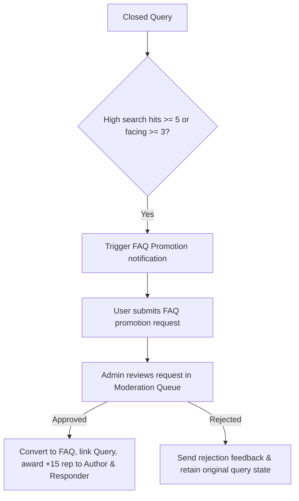

# Product: Grantha

## Overview
**Grantha** is a community-driven knowledge ecosystem purpose-built for cohort-based learning programs, internships, and structured training tracks (such as the **Grantha** internship, **VINS**, and **ViBe LMS** tracks). It bridges the gap between static FAQ documentation and ephemeral chat-based support channels (like Discord or WhatsApp) by combining:
1. **An Active Response-Driven Q&A Board** where users ask technical/programmatic questions and volunteers resolve them.
2. **A Peer-Vetted Wiki & FAQ Database** that automatically surfaces high-quality community answers.
3. **A Local AI (RAG) Assistant** that instantly resolves incoming questions by running vector semantic search over the FAQ database.

---

## Problem Statement
Traditional cohort education and support systems suffer from several core friction points:
* **Redundant Questions (Duplicate Overhead):** Cohorts often ask the same questions repeatedly. Mentors spend disproportionate time answering them, and knowledge gets buried.
* **Out-of-Scope Noise:** General knowledge queries and off-topic discussion clutter technical tracks.
* **Slow Query Resolution:** Students wait hours for help, stalling their progress, while volunteers might hoard queries without resolving them.
* **Quality Assurance & Trust:** Crowdsourced answers on open platforms often suffer from spam, incorrect advice, or reputation farming.
* **Institutional Knowledge Fragmentation:** Critical solutions resolved in individual chats are lost to future cohorts, creating a perpetual support bottleneck.

---

## Target Users
* **Cohort Participants / Students:** Seek quick, context-accurate answers to technical, procedural, or policy questions to unblock their learning.
* **Volunteer Responders / Peers:** Advanced participants or alumni who answer queries, vet answers, earn reputation, and build their professional profile.
* **Program Administrators / Mentors:** Oversee the cohort, handle escalations, approve FAQ promotion requests, pin announcements, and audit database revisions.

---

## Goals
* **Sub-10ms Latency for FAQ Lookups:** Bypass LLM inference for duplicate questions using a high-efficiency Jaccard cache.
* **Zero Lost Questions:** Ensure every student question is actively monitored and resolved via claim release timers.
* **Mentor Support Offloading:** Distribute the support load to peer volunteers and automated AI responses.
* **Privacy-First AI Assistance:** Run LLM embeddings and generation locally without sending student data to external cloud services.

---

## Non-Goals
* **Real-Time Interactive Chatrooms:** The platform utilizes structured forum threads rather than instant messaging.
* **Third-Party OAuth Delegations:** Authentication is self-contained via secure JWT tokens in HTTP-only cookies.
* **Multi-Turn Conversational AI Memory:** The RAG assistant resolves single-turn queries based on semantic context rather than ongoing multi-turn conversations.

---

## User Stories
* **As an intern,** I want to search for internship certificate guidelines so that I can get immediate answers or find the existing thread.
* **As an intern raising a query,** I want the system to warn me if my question is a duplicate, redirecting me to the answer so I don't waste time or lose reputation points.
* **As a volunteer,** I want to claim an open query in my area of expertise and submit an answer so that I can earn reputation points once it is accepted or vetted.
* **As an administrator,** I want to approve proposed FAQ promotions, pin important announcements to the home board, and check the audit logs to track content revisions.

---

## Features

### 💬 Community Q&A Board
* **Query Lifecycle:** Queries progress from `open` $\rightarrow$ `claimed` (volunteer assigned) $\rightarrow$ `answered` (response submitted) $\rightarrow$ `closed` (answer accepted by owner).
* **Rich Attachments:** Supports drag-and-drop file uploads (up to 5 images, PDFs, or documents) and markdown-rendered descriptions.
* **Collaborative Indicators:** Users can click *"I am facing this issue as well"* to bump the query's importance and trigger notification alerts for growing contributors.

### 🤖 Local RAG (AI) Chat Widget
* **Instant Support:** A floating chat widget available on all pages where users can chat with the **RAG Assistant**.
* **Vector Semantic Search:** Embeds the FAQ corpus using a local **Ollama** LLM runner. It queries the vector database for cosine similarity and falls back to BM25 search if Ollama is offline.
* **Reference Transparency:** Displays the specific source FAQ cards used to generate the AI response, allowing users to verify the context.

### 🏆 Gamification & Leaderboard
* **Reputation Credits:** Users earn reputation points for helpful actions:
  * **+5 points** for vetting a peer volunteer's answer.
  * **+10 points** for proposing a query for FAQ promotion.
  * **+15 points** for having an answer promoted to a permanent FAQ.
* **Anti-Collusion Throttling:** Restricts peer-to-peer voting (e.g., users can only upvote a single peer's answers twice in a 24-hour window) to prevent reputation farming.
* **Leaderboard Page:** Showcases the cohort's top volunteers, sorted by verified reputation scores (excluding admins).

### 🛡️ Admin Control Station (Midnight Command Center)
* **Vertical Navigation Sidebar:** A fixed navigation rail positioned on the rightmost edge of the viewport containing icon buttons for fast tab switching.
* **Live Activity Audit Feed:** A chronological timeline displaying administrative actions (soft-deletes, restores, response breach resolutions) with color-coded badges.
* **Moderation Queue:** Centralized interface for approving/rejecting FAQ promotion requests and resolving response breaches.
* **Pin Administration:** Create and manage sticky overview banners, cohort announcements, or spotlight FAQs pinned to the top of pages.

---

### Key Workflows & State Diagrams

#### 1. Query Submission & Pre-Filtering

#### 2. Response Claim Lifecycle

#### 3. Collaborative FAQ Promotion

---

## Success Metrics
* **Direct Cache Resolution Rate:** $\ge$ 30% of user queries redirected immediately to existing answers at the pre-filtering step.
* **Average Response Time:** Open community queries claimed and answered within 24 hours.
* **Mentor Load Reduction:** $\ge$ 80% of support requests resolved by community volunteers or local AI without admin escalation.
* **Anti-Collusion Flag Rate:** System flags and blocks overlapping upvote pairs to maintain leaderboard integrity.

---

## Constraints
* **Local Hardware Execution:** The local RAG engine runs on CPU/GPU via Ollama. Server scripts require memory optimizations (`--max-old-space-size=4096`) under Windows environments to prevent build OOM errors.
* **Voluntary Allocation Limit:** Volunteers are restricted to exactly 1 active query claim at a time to prevent task hoarding.
* **Strict Anti-Spam Penalties:** Query duplication attempts result in an automatic `-2` reputation penalty to discourage spamming.

---

## Open Questions
* **Dynamic Tag Classification:** How can we leverage the local LLM to automatically tag incoming queries rather than relying on manual user selection?
* **File Storage Scaling:** Should we keep local disk storage for attachment uploads or containerize a MinIO/GridFS volume for large-scale production?

---

## Future Ideas
* **Multi-turn RAG Chat History:** Pass conversational message arrays to Ollama to support follow-up prompts within the widget.
* **UI-based Role Administration:** Direct admin console features to promote volunteers to moderators or admins without manual DB edits.
* **Real-time Push Notifications:** Implement WebSockets (Socket.io) to push claim alerts and answers instantly.
* **Slack / Discord Integration:** Bot webhooks to query local RAG context directly from cohort communication channels.
