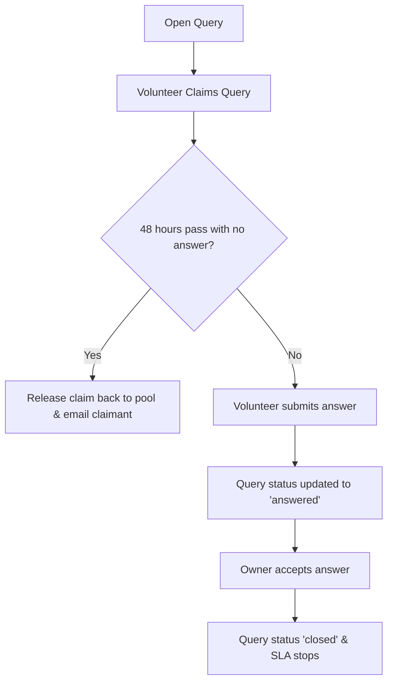
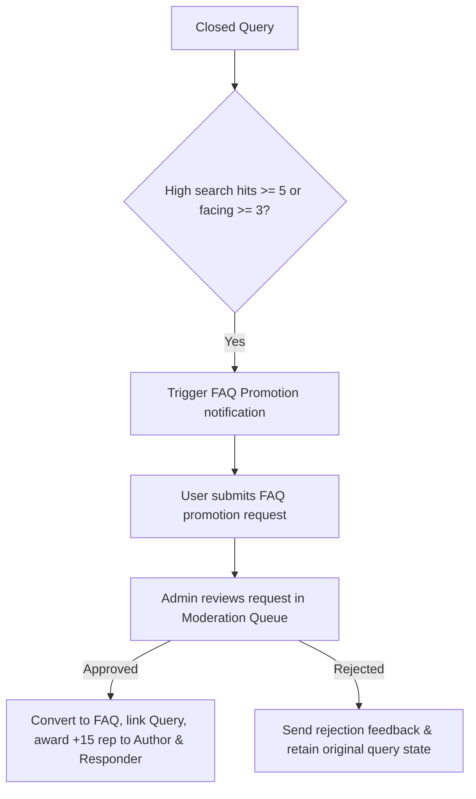

# Product Specification: Community Knowledge & Q&A Platform

This document outlines the product vision, core features, gamification design, administrative workflows, and technical details of the FAQ & Community Q&A platform (cs16).

---

## 1. Product Vision

The platform is a community-driven knowledge ecosystem designed specifically for cohort-based programs, internships, and structured learning paths (such as the **Grantha** internship, **VINS**, and **ViBe LMS** tracks). It bridges the gap between static documentation and real-time chat support by combining:
1. **An SLA-Driven Q&A Board** where users ask technical/programmatic questions and volunteers resolve them.
2. **A Peer-Vetted Wiki & FAQ Database** that automatically surfaces high-quality community answers.
3. **A Local AI (RAG) Assistant** that instantly resolves incoming questions by running vector semantic search over the FAQ database.

---

## 2. Core Problems Solved

* **Redundant Questions (Duplicate Overhead):** Cohorts often ask the same questions repeatedly. The platform detects duplicates at submission time using **Jaccard Similarity** (for title overlap) and **BM25 Search** (for content indexing), blocking duplicate posts and pointing users directly to existing answers.
* **Out-of-Scope Noise:** Filters out completely off-topic questions (e.g., general knowledge, personal queries) at submission using a keyword scope filter, keeping the platform focused strictly on program guidelines and technical tracks.
* **Slow Query Resolution:** Enforces a **24-Hour SLA** (Service Level Agreement). Volunteers claim queries to work on them. If a claim is inactive for 48 hours without a response, the platform automatically releases it back to the community and alerts the volunteer.
* **Quality Assurance & Trust:** Avoids spam and incorrect advice by tying publishing privileges to a **Trust-Based Gamification** system. Highly reputable users (reputation $\ge$ 50) and admins have their responses auto-vetted, while newer users' answers require manual vetting by peer volunteers.

---

## 3. Key Product Features

### 💬 Community Q&A Board
* **Query Lifecycle:** Queries progress from `open` $\rightarrow$ `claimed` (volunteer assigned) $\rightarrow$ `answered` (response submitted) $\rightarrow$ `closed` (answer accepted by owner).
* **Rich Attachments:** Supports drag-and-drop file uploads (up to 5 images, PDFs, or documents) and markdown-rendered descriptions.
* **Collaborative Indicators:** Users can click *"I am facing this issue as well"* to bump the query's importance and trigger notification alerts for growing contributors.

### 🤖 Local RAG (AI) Chat Widget
* **Instant Support:** A floating chat widget available on all pages where users can chat with the **RAG Assistant**.
* **Vector Semantic Search:** Embeds the FAQ corpus using a local **Ollama** LLM runner. It queries the vector database for cosine similarity and falls back to BM25 search if Ollama is offline.
* **Reference Transparency:** Displays the specific source FAQ cards used to generate the AI response, allowing users to verify the context.

### 🏆 Gamification & Leaderboard
* **Reputation Credits:** Users earn reputation points for helpful actions:
  * **+5 points** for vetting a peer volunteer's answer.
  * **+10 points** for proposing a query for FAQ promotion.
  * **+15 points** for having an answer promoted to a permanent FAQ.
* **Anti-Collusion Throttling:** Restricts peer-to-peer voting (e.g., users can only upvote a single peer's answers twice in a 24-hour window) to prevent reputation farming.
* **Leaderboard Page:** Showcases the cohort's top volunteers, sorted by verified reputation scores (excluding admins).

### 🛡️ Admin Control Station (Midnight Command Center)
* **Vertical Navigation Sidebar:** A fixed navigation rail positioned on the rightmost edge of the viewport containing icon buttons for fast tab switching.
* **Live Activity Audit Feed:** A chronological timeline displaying administrative actions (soft-deletes, restores, SLA breach resolutions) with color-coded badges.
* **Moderation Queue:** Centralized interface for approving/rejecting FAQ promotion requests and resolving SLA breaches.
* **Pin Administration:** Create and manage sticky overview banners, cohort announcements, or spotlight FAQs pinned to the top of pages.

---

## 4. Key Workflows & State Diagrams

### 1. Query Submission & Pre-Filtering

### 2. SLA Claim Lifecycle

### 3. Collaborative FAQ Promotion

---

## 5. Technology Stack

* **Frontend:** React 18, Vite, React Router v6, TailwindCSS.
* **Backend:** Node.js, Express.js.
* **Database:** MongoDB (using Mongoose).
* **AI Engine:** Ollama (local model runner for vector embeddings).
* **Visuals:** Chart.js, React-Chartjs-2 for analytics charts.
* **Testing:** Jest, Supertest for integration and route security suites.
